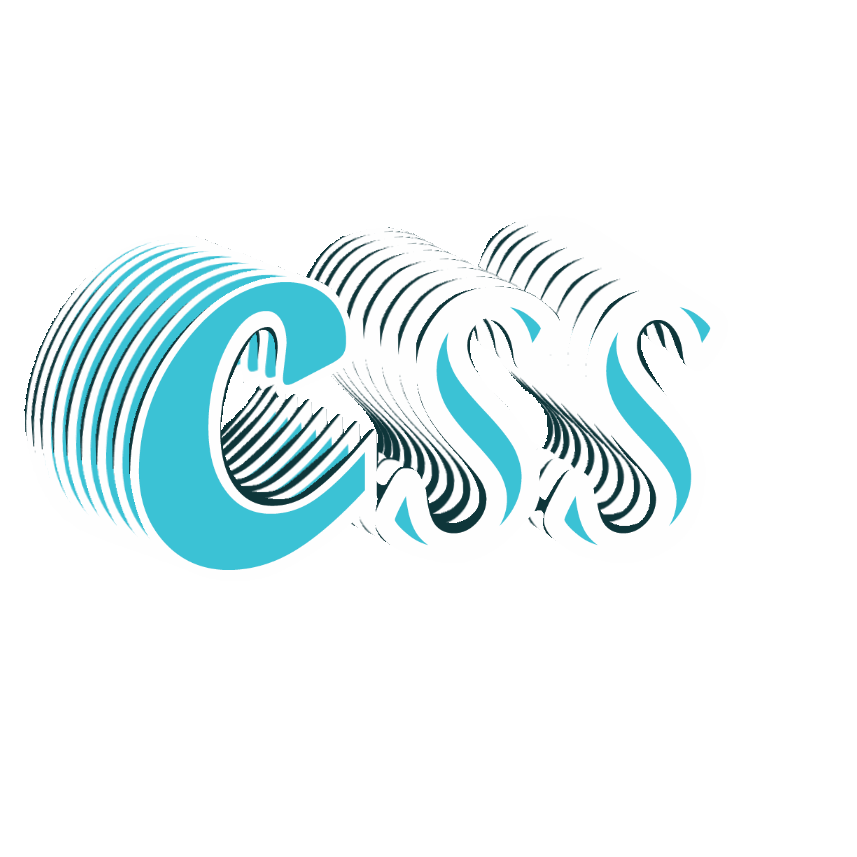

<p align="center">
  <h1 align="center">🎨 CSS Advanced</h1>
</p>

<p align="center">
  
</p>

<p align="center">
  <b>Amateur → Intermediate CSS Project</b><br>
  <i>By Guillaume Salva, CTO at Holberton School</i><br>
  📁 Part of the <code>holbertonschool-web-development</code> repository  
  <br>
  👨‍💻 Made with ❤️ by <a href="https://github.com/JosephBmbs">JosephBmbs</a>
</p>

---

## 📚 Description

Welcome to the **CSS Advanced** project! This is a continuation of the previous **HTML, advanced** project. Here, we dive deeper into the power of **CSS** to bring life and style to static web pages.

You will explore:
- CSS selectors and specificity
- Box model properties
- Styling rules
- How browsers render styles
- Inline styles, classes, and much more!

The ultimate goal? Create beautifully styled pages, just like a real frontend developer. 🧑‍🎨

---

## 🎯 Learning Objectives

By the end of this project, you should be able to **explain** (without using Google):

✅ What is CSS  
✅ How to add style to an element  
✅ What is a class  
✅ What is a selector  
✅ How to compute CSS Specificity Value  
✅ What are Box properties in CSS  
✅ How the browser loads a webpage  

---

## 📂 Project Structure

```
css_advanced/
├── index.html      # Copied from HTML, advanced project
├── README.md       # This file
└── styles/
    └── style.css   # Your beautiful stylesheet
```

---

## 🛠️ Requirements

### ✅ General Rules

- All files must end with a **new line**
- No external libraries allowed ❌ (No Bootstrap, Tailwind, React, etc.)
- **Pure HTML/CSS/JS only**
the code must be **W3C compliant** ✅ ([W3C Validator](https://validator.w3.org/))

---

## 🧠 Resources

Here are the key readings and tools to succeed:

- [Learn to Code HTML & CSS](https://learn.shayhowe.com/html-css/)
- [Inline Styles in HTML](https://www.w3schools.com/html/html_styles.asp)
- [CSS Specificity](https://developer.mozilla.org/en-US/docs/Web/CSS/Specificity)
- [CSS Specifishity](https://specifishity.com/)
- [MDN Web Docs - CSS](https://developer.mozilla.org/en-US/docs/Web/CSS)

---

## 🎨 Design References

> The final design is available on **Figma**.

📌 [👉 View the Design in Figma](https://www.figma.com/design/XrEAsu1vQj5fhVaNG38d2W/Homepage?node-id=0-1&t=tUdVBtWf0qDGfCdb-1)  
💡 Don’t forget to **Duplicate to your Drafts** to explore spacing, fonts, and layout details!

> **Fonts required:**
> - Source Sans Pro
> - Spin Cycle OT  
> [Download Fonts](https://fonts.google.com/specimen/Source+Sans+Pro)

---

## 📌 Tasks Overview

- ✅ **0. README and objectives!**
    - Write this README file ✔️
    - Copy `index.html` from the previous HTML project
- 🎯 Focus on CSS structure, classes, IDs, and styling
- 🧪 Validate your HTML and CSS with W3C
- 📸 Follow Figma designs pixel-perfectly

---

## 🤝 Acknowledgements

Thanks to **Holberton School** and **Guillaume Salva** for the project guidance.  
Built with 💙 by [JosephBmbs](https://github.com/JosephBmbs) on the web development journey.
---

<p align="center"><b>Happy Styling! 🎨</b></p>
